# 九连环递归算法及其拓展
杨旭东 1410658 信息安全、法学双学位班<br>
## 1 九连环简介
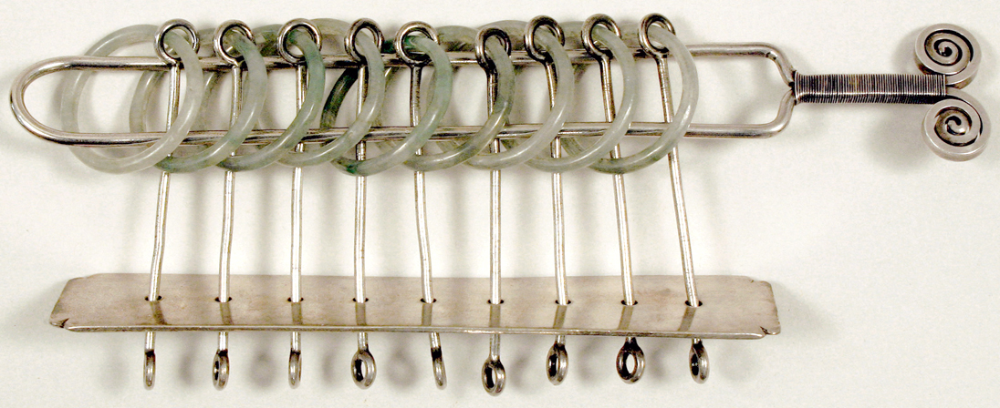<br>

九连环是中国最杰出的益智游戏。长期以来，这个益智游戏是数学家及现代的电子计算机专家们用于教学研究的课题和例子。

九连环以金属丝制成9个圆环，将圆环套装在横板或各式框架上，并贯以环柄。把玩时，按照一定的程序反复操作，可使9个圆环分别解开，或合二为一。从完整状态解下所有九个环一般需要解341步。
## 2 九连环规则
在解九连环的过程中间，只有两个规则可循。并且这两个规则在游戏中交替使用：

规则一：第一环可以在任何时候放上或取下环柄。

规则二：只有紧跟在领头环后的环可以放上或取下环柄。（领头环是套在柄上的最前面的环）

如果所有的环都在柄上，那么第一步可以有两个选择。（根据规则一，取下第一环；或者根据规则二，取下第二环。）但是，走完第一步以后，我们只需要交替使用这两个规则，就不会走回头路。

当环数是奇数时，第一步必须是要将第一环取下（规则一）。要解是偶数的连环时，第一步则是要将第二环取下（规则二）。取下一个环就是要将这个环滑过柄尖并从柄中由上而下滑下。放上一个环就是要将这个环由下而上穿过柄中，再滑过柄尖放入柄上。
## 3 九连环递归描述
    （1）第 1 环可以自由上下
    （2）而上/下第 n(n>1) 环时，则必须满足：
        （a）第 n-1 个环在架上
        （b）前 n-2 个环全部在架下
## 4 九连环拆解安装过程
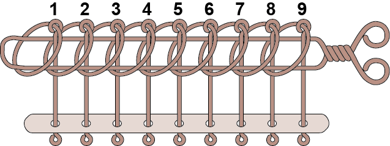<br>

正确的拆解是先以第 9 环为目标，先拆下它，简化为拆一个 8 连环。接着再也第 8 环为目标，拆下它，简化为拆一个 7 连环。以此类推，直至全部拆解。

其实安装和拆解是一个道理，因为他们均是使用上面说的规律来完成的。

正确是安装也是先以第 9 环为目标，先装上它，简化为装一个 8 连环。接着再也第 8 环为目标，装上它，简化为装一个 7 连环。以此类推，直至全部安装。

实践中，我们会进一步发现一个简单规律，当安装上第 9 环后，问题可以被简化为装一个 7 连环，而当装上第 7 环后，问题就被简化为装一个 5 连环了。
## 5 求解九连环及相关问题
### 5.1 拆解/安装 n 连环
#### 5.1.1 问题描述
输入一个正整数 n ，输出 n 连环的拆解和安装步骤，以及相应步骤数。
#### 5.1.2 编程思路
递归实现问题求解。

拆解 n 连环，首先在第 n-1 在轴上的前提下卸下第 n 环前需要将前 n-2 环全部卸下，然后才能卸下第 n 环，之后装上前 n-2 环，此时已经简化为拆解 n-1 连环问题，开始拆解 n-1 连环，步骤同 n 连环。

安装 n 连环，首先在安装第 n 环前需要先将第 n-1 环装上以及卸下前 n-2 环，之后才能装上第 n 环，此时可以直接简化为安装 n-2 连环问题，开始安装 n-2 连环，步骤同 n 连环。

以此类推，实现递归。
#### 5.1.3 编程实现

>源码位于ChineseRings.cpp文件

```c++
/*****************************************
* 功能：拆解&安装n连环
* 介绍：输入数字n
*      输出n连环的解法和装法以及相应步数
* 
* 仅支持环全部在轴上时解下和环全部在轴下时装上
******************************************/

#include<iostream>   

using namespace std;

class Ring
{
public:
    Ring(int n) :nRingNum(n) {}
    void UpRing(int n);
    void DownRing(int n);
    void startDownRing();
    void startUpRing();
    void totalCnt();
    void setUpZero();
private:
    int nRingNum;
    static int s_nCnt;
};

//记录拆装步骤数
int Ring::s_nCnt = 0;    

void Ring::UpRing(int n)
{//Upring是DownRing的逆过程 
    if (n != 0)
    {
        ++s_nCnt;
        if (n > 1) UpRing(n - 1);
        if (n > 2) DownRing(n - 2);
        cout << "上第" << n << "环" << endl;
        if (n > 2) UpRing(n - 2);
    }
}

void Ring::DownRing(int n)
{
    if (n != 0)
    {
        ++s_nCnt;
        if (n > 2) DownRing(n - 2);
        cout << "下第" << n << "环" << endl;
        if (n > 2) UpRing(n - 2);
        if (n > 1) DownRing(n - 1);
    }
}

void Ring::startDownRing()
{// 拆解九连环
    cout << "拆解" << nRingNum << "连环操作!" << endl;
    DownRing(nRingNum);
    cout << "拆解完毕" << endl;
}

void Ring::startUpRing()
{// 安装九连环
    cout << "安装" << nRingNum << "连环操作!" << endl;
    UpRing(nRingNum);
    cout << "安装完毕" << endl;
}

void Ring::totalCnt()
{
    cout << "共累计上、下环" << s_nCnt << "次!" << endl << endl;
}

void Ring::setUpZero()
{
    Ring::s_nCnt = 0;
}

int main()
{
    int n;
    cin >> n;
    Ring ring(n);

    // 拆解过程
    ring.startDownRing();
    ring.totalCnt();
    ring.setUpZero();//将步骤数清零，以便记录安装步骤

    // 安装过程
    ring.startUpRing();
    ring.totalCnt();
    ring.setUpZero();

    return 0;
}
```
#### 5.1.4 程序演示
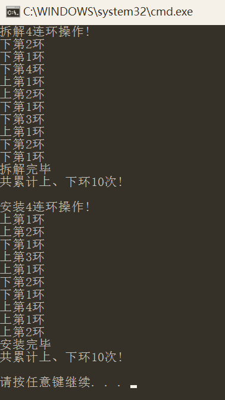<br>
### 5.2 拆解/安装任意状态九连环
#### 5.2.1 问题描述
九连环共有 9 位在轴上和在轴下可以分别用 1 和 0 表示，那么九连环可能的状态共有 2^9=512 种。

输入一个九连环的当前状态（ 9 位 01 串表示），输出此状态下的九连环的最快解法和最快装法，以及相应步数。
#### 5.2.2 编程思路
编程思路与前面 5.1 类似，但并不完全相同。也是递归实现，但是要考虑其中状态的问题，并不是像 5.1 中完整的 n 连环那样容易。

首先简化问题难度，如果是拆解九连环则从最后一个在轴上的环开始向前解，同理，安装九连环从最后一个不在轴上的环开始向前装，这样会省去一些递归。

拆解第 n 环，首先检查，如果当前环在轴上，则跳过，开始拆解前一个环，重复此步骤；接着如果第 n-1 环在下，需要上第 n-1 环，然后下 第 n-2 环，之后下第 n 环；第 n 环拆下后，需要将之前卸下的第 n-2 环装上，再下第 n-1 环，重复回第一步；

安装第 n 环，首先如果第 n-1 环在下，需要上第 n-1 环，然后下 第 n-2 环，之后上第 n 环； 第 n 环安装后，需要将之前卸下的第 n-2 环装上（如果在上则不需，因为可能第 n 环也在上跳过之前一步），再上第 n-2 环，重复回第一步；

重复递归实现。
#### 5.2.3 编程实现

>源码位于allChineseRings.cpp文件

```c++
/*****************************************
* 功能：拆解&安装九连环
* 介绍：输入九连环当前状态（9位01串表示）
*      输出此时九连环的解法和装法以及相应步数
*      0表示环在轴下
*      1表示环在轴上
*
* 支持九连环全部状态的解法和装法
******************************************/

#include <iostream>   
#include <string>

using namespace std;

class Ring
{
public:
    Ring(string s);
    void UpRing(int n);
    void DownRing(int n);
    void startDownRing();
    void startUpRing();
    void totalCnt();
    void setUpZero();
private:
    int nDownRingNum;
    int nUpRingNum;
    static int s_nCnt;
    string stRing;
};

// 记录拆装步骤数
int Ring::s_nCnt = 0;  

Ring::Ring(string s)
{// 用于简化问题，拆解过程中后面的 0 可忽略不计；安装过程中后面的 1 可忽略不计
    stRing = s;
    for (int i = 0;i < 9;i++)
    {
        if (s[i] == '1')nDownRingNum = i + 1;
        if (s[i] == '0')nUpRingNum = i + 1;
    }
}

void Ring::UpRing(int n)  
{// 上环
    if (n > 0)
    {
        if (n > 1 && stRing[n - 2] == '0') UpRing(n - 1);
        if (n > 2) DownRing(n - 2);
        if (stRing[n - 1] == '0')
        {
            stRing[n - 1] = '1';
            ++s_nCnt;
            cout << "上第" << n << "环" << endl;
        }
        if (n > 1 && stRing[n - 2] == '0') UpRing(n - 1);
        if (n > 2) UpRing(n - 2);
    }
}

void Ring::DownRing(int n)
{// 下环
    while (n >= 1 && stRing[n - 1] == '0')n--;
    if (n > 0)
    {
        if (n > 1 && stRing[n - 2] == '0') UpRing(n - 1);//
        if (n > 2) DownRing(n - 2);

        stRing[n - 1] = '0';
        ++s_nCnt;
        cout << "下第" << n << "环" << endl;

        if (n > 2) UpRing(n - 2);
        if (n > 1) DownRing(n - 1);
    }
}

void Ring::startDownRing()
{
    cout << "拆解九连环:" << stRing << endl;
    DownRing(nDownRingNum);
    cout << "拆解完毕" << endl;
}

void Ring::startUpRing()
{
    cout << "安装九连环:" << stRing << endl;
    UpRing(nUpRingNum);
    cout << "安装完毕" << endl;
}

void Ring::totalCnt()
{
    cout << "共累计上、下环" << s_nCnt << "次!" << endl << endl;
}

void Ring::setUpZero()
{
    Ring::s_nCnt = 0;
}

int main()
{
    // 输入的九连环状态 01 串
    string s;
    cin >> s;

    // 拆解过程
    Ring dring(s);
    dring.startDownRing();
    dring.totalCnt();
    dring.setUpZero();

    // 安装过程
    Ring uring(s);
    uring.startUpRing();
    uring.totalCnt();
    uring.setUpZero();

    return 0;
}
```
#### 5.2.4 程序演示
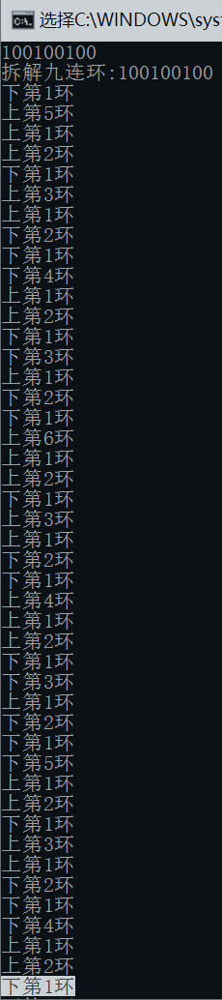
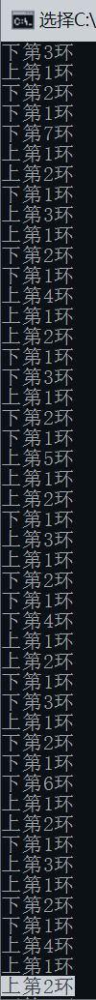
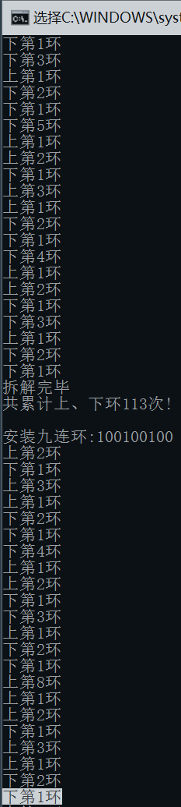<br>
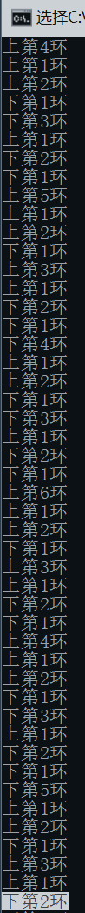
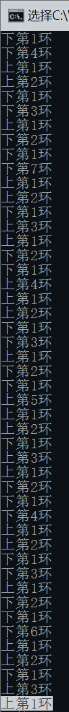
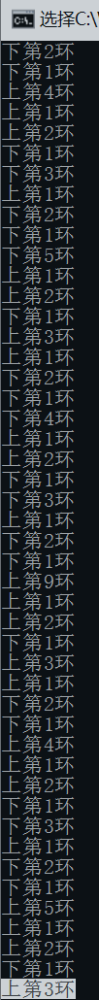
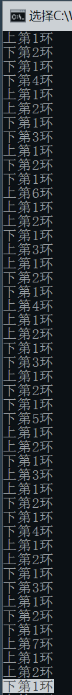
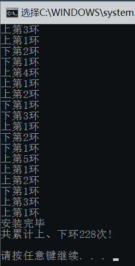
## 6 九连环问题拓展延伸——连环锁与格雷码
### 6.1 九连环与格雷码的关系
智力玩具九连环的状态 变化符合格雷码的编码规律，汉诺塔的解法也与格雷码有关。

九连环中的每个环都有上下两种状态，如果把这两种状态用0/1来表示的话，这个状态序列就会形成一种循环二进制编码（格雷码）的序列。所以解决九连环问题所需要的状态变化数就是格雷码111111111所对应的十进制数341。
### 6.2 问题描述
你现在要操作的是一个n连环，n为正整数，给出n连环的两种状态，计算出从第一种状态变换到第二种状态所需要的最少步数。

输入：第一行是一个正整数m，表示有m组测试数据。 
每组测试数据一共3行，第一行是一个正整数n (0 < n < 128)，后两行每一行描述一种状态，n个数（0或1），用空格隔开。

输出：对于每一组测试数据输出一行，一个非负整数，表示从第一种状态变换到第二种状态所需要的最少步数。
### 6.3 编程思路
将输入的两种状态当初格雷码转换成二进制再转成十进制，最后两个十进制的差的绝对值就是结果。
### 6.4 转换规则
二进制码->格雷码：从最右边一位起，依次将每一位与左边一位异或，作为对应格雷码该位的值，最左边一位不变； 

格雷码->二进制码：从左边第二位起，将每位与左边的所有值异或，作为该位解码后的值（最左边一位依然不变）。
### 6.5 编程实现
此处只简单实现了格雷码与二进制码的转换。
```c++
int toGray(int x)
{// 转化为格雷码  
    return x^(x>>1);  
}  
int toBinary(int x)
{// 格雷码转化为二进制  
    int y = x;  
    while(x>>=1){  
        y ^= x;  
    }  
    return y;  
}  
```
## 参考资料
[1] [九连环 - 中国古代益智游戏](http://chinesepuzzles.org/zh/nine-linked-rings-puzzle/) http://chinesepuzzles.org/zh/nine-linked-rings-puzzle/<br>
[2] [九连环（中国传统民间游戏）_百度百科](http://baike.baidu.com/item/%E4%B9%9D%E8%BF%9E%E7%8E%AF/23636) http://baike.baidu.com/item/%E4%B9%9D%E8%BF%9E%E7%8E%AF/23636<br>
[3] [格雷码_百度百科](http://baike.baidu.com/item/%E6%A0%BC%E9%9B%B7%E7%A0%81) http://baike.baidu.com/item/%E6%A0%BC%E9%9B%B7%E7%A0%81<br>
[4] [1832 -- 连环锁](http://poj.org/problem?id=1832) http://poj.org/problem?id=1832<br>


